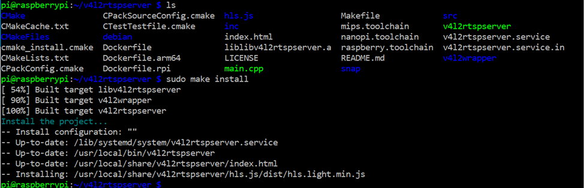

# v4l2rtspserver on Raspbian OS Bullseye

This write-up is intended to help anyone who experienced problem while trying to install v4l2rtspserver written by Michel Promonet on a new Debian-based Raspbian OS Bullseye. Don’t give up!

ASSUMPTION: The system is Bullseye-d ready. Mine is a Raspberry Pi Model B Rev 2


## Install deps, build and install

``` bash
sudo apt install liblivemedia-dev liblog4cpp5-dev libasound2-dev libssl-dev
git clone https://github.com/mpromonet/v4l2rtspserver.git
cd v4l2rtspserver
git clone https://github.com/mpromonet/libv4l2cpp.git v4l2wrapper
cmake . && make && sudo make install
```



## Create a service to start the rtspserver automatically

copy the script and the .service file:
`sudo cp control_v4l2rtpserver.sh /usr/sbin`
`sudo cp v4l2rtspserver.service /etc/systemd/system`

reload the services:

`sudo systemctl daemon-reload`

start the service and check its status:

`sudo systemctl start v4l2rtspserver`
`sudo systemctl status v4l2rtspserver`

if the service started successfully enable it for running at startup:

`sudo systemctl enable v4l2rtspserver`
